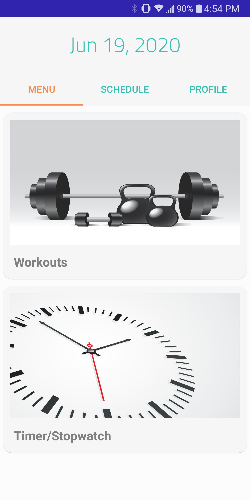
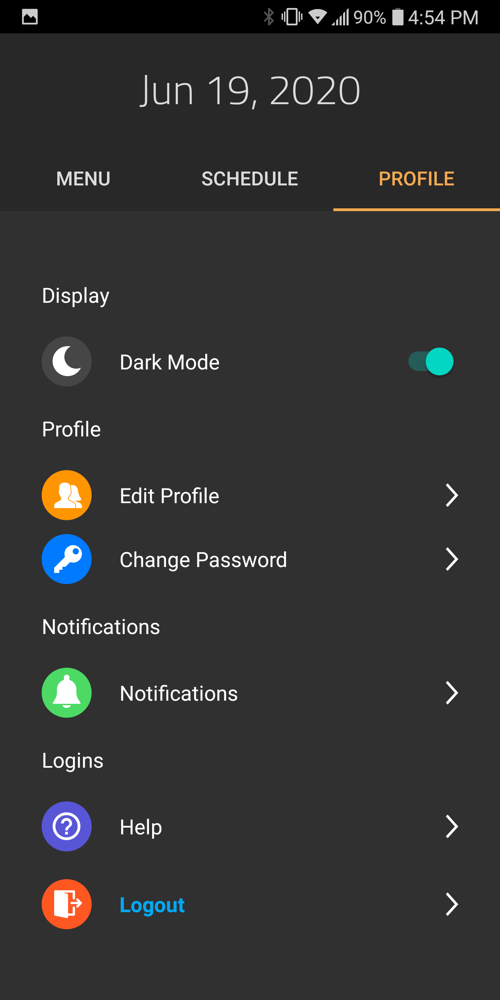
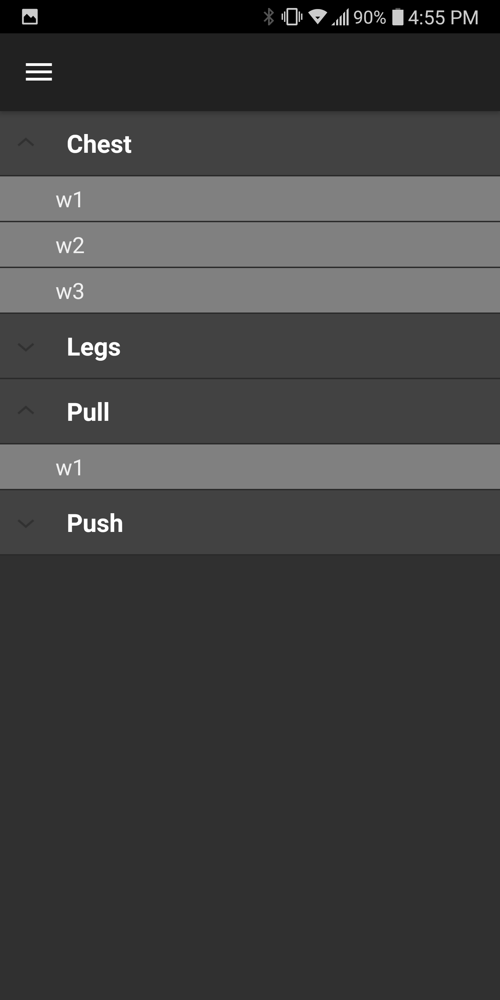
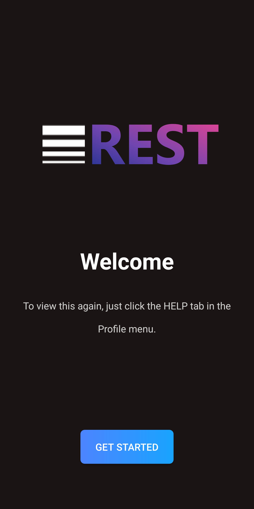

# FitnessApp
Workout app to keep track of workouts to help remember exercises and number of sets and reps. Develop a workout routine using the in-built notes and workout organization tools.
 [REST-Fitness Planner](https://play.google.com/store/apps/details?id=com.rest.fitnessapp) on Google Play Store.  

   
